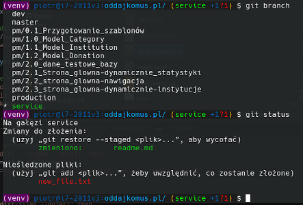

# instalacja i konfiguracja oprogramowania dla projektu Django

### 1. Modyfikacja promptu terminala

Funkcja kopiuje plik skryptu do katalogu domowego urzytkownika oraz rejestruje go w tym samym katalogu w pliku __.bashrc__.

Skrypt __git_venv_prompt.sh__ autorstwa Artem Mavrin, link do orginalnego skryptu: https://github.com/artemmavrin/git-venv-prompt

__Wyświetlane informacje:__

- host
- użytkownik
- bierzący katalog (W). Pełną ścieżkę uzyskać można zmieniając "W" na "w" w 21 lini pliku __git_venv_prompt.sh__
    - w katalogu instalatora przed wykonaniem skrypu
    - w katlogu domowym użytkownika po wykonajiu skryptu

Z mojej strony modyfkiacja skryput:

- Zmiana kolorystyki
- Dodanie komentarza z linkiem do strony z paletą kolorów
- Przeniesienie wyświetlania środowiska virtualenv do początku wiersza

__Funkcje i wygląd wiersza__

